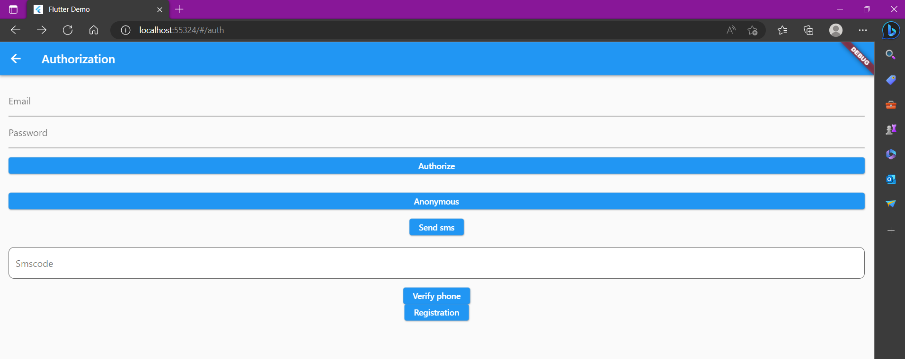
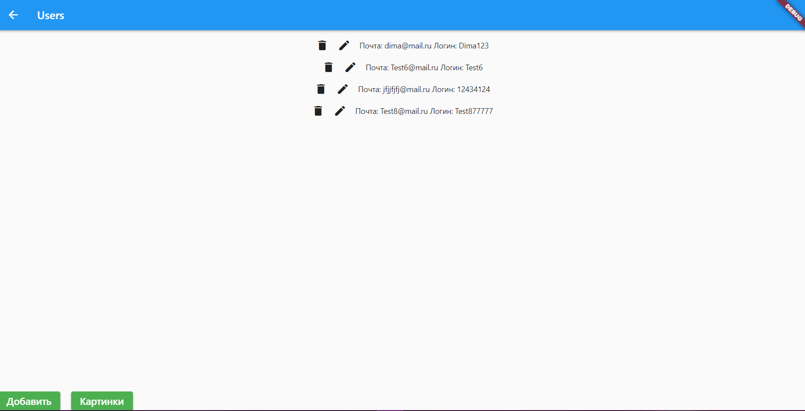
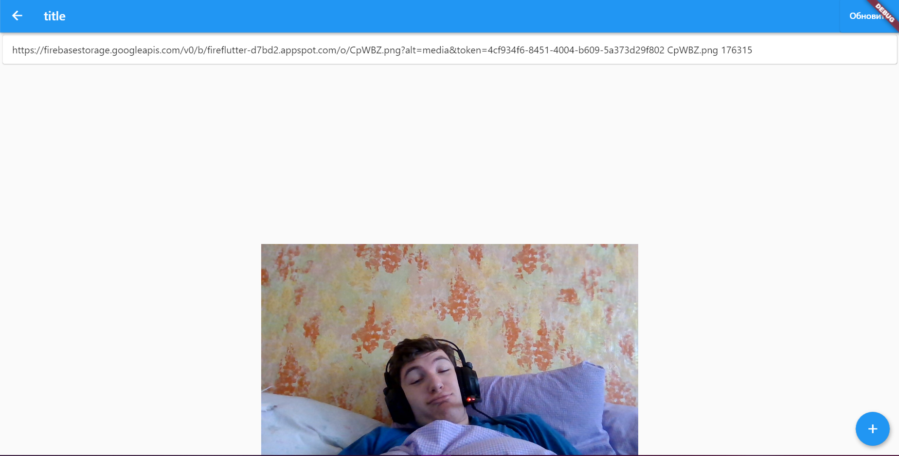

# Практические 3, 4 и 5 

## Работа с Firebase и FireStore

<b>Цель:</b> Научиться работать с Firebase и Firestore ,и FireStorage, а также сделать различные способы авторизации при помощи FirebaseAuth, а также CRUD действия используя FireStore

Вначале подключаем необходимые зависимости в проект, после чего переходим на главный экран и верстаем страницы авторизации и регистрации. После чего в методе для регистрации прописываем следующий код

``` dart 
UserCredential userCredential = await auth.createUserWithEmailAndPassword(
    email: _emailController.text,
        password: _passwordController.text,
      );
```
После чего переходим на страницу авторизации и прописываем различные методы для авторизации пользователей.
Авторизация по логину и паролю

``` dart  
    FirebaseAuth.instance
                        .signInWithEmailAndPassword(
                            email: _emailController.text,
                            password: _passwordController.text)
                        .then((value) => ScaffoldMessenger.of(context)
                            .showSnackBar(SnackBar(
                                content: Text("Успешная Авторизация"))))
                        .catchError((error) => ScaffoldMessenger.of(context)
                            .showSnackBar(
                                SnackBar(content: Text("Error: $error"))));
                                Navigator.pushNamed(context, MainScreen.routeName);
```

Анонимный вход

```dart
     FirebaseAuth.instance.signInAnonymously().then((value) {
                    print(value.user?.uid);
                  });
```

Авторизация через СМС

``` dart
    
    await FirebaseAuth.instance.verifyPhoneNumber(
                      phoneNumber: _emailController.text,
                      codeSent:
                          (String verificationId, int? resendToken) async {
                        verificationid = verificationId;
                        //resendToken1 = resendToken;
                        var showSnackBar = ScaffoldMessenger.of(context)
                            .showSnackBar(const SnackBar(
                          content: Text(
                            "SMS отправленo",
                          ),
                        ));
                      },
                      codeAutoRetrievalTimeout: (String verificationId) {},
                      verificationCompleted:
                          (PhoneAuthCredential phoneAuthCredential) {},
                      verificationFailed: (FirebaseAuthException error) {},
                    );
 ```
 Подтверждение СМС

```dart
    
      String smsCode = _verifyController.text;

// Create a PhoneAuthCredential with the code
                    PhoneAuthCredential credentiall =
                        PhoneAuthProvider.credential(
                            verificationId: verificationid, smsCode: smsCode);

// Sign the user in (or link) with the credential
                    await FirebaseAuth.instance
                        .signInWithCredential(credentiall);
                    ScaffoldMessenger.of(context).showSnackBar(SnackBar(
                      content: Text(
                        "${FirebaseAuth.instance.currentUser!.uid}, ${FirebaseAuth.instance.currentUser!.phoneNumber}",),),)
```

После чего переходим к рабготе с FireStore и дописываем метод для регистрации

```dart
      try {
      await fireStore
          .collection('user')
          .doc(userCredential.user!.uid)
          .set(
            {'email': _emailController.text, 'login':_loginController.text},
          )
          .then((value) => ScaffoldMessenger.of(context)
              .showSnackBar(SnackBar(content: Text("Успешная регистрация"))))
          .catchError((error) => ScaffoldMessenger.of(context).showSnackBar(
              SnackBar(content: Text("Error: $error"))));
       Navigator.pushNamed(context, MainScreen.routeName);
    } on FirebaseAuthException catch (e) {
      if (e.code == 'weak-password')
        ScaffoldMessenger.of(context)
            .showSnackBar(SnackBar(content: Text('Пароль слишком слабый')));
      else if (e.code == 'email-already-in-use')
        ScaffoldMessenger.of(context).showSnackBar(SnackBar(
            content: Text('Этот адрес электронной почты уже используется')));
    } catch (e) {
      ScaffoldMessenger.of(context)
          .showSnackBar(SnackBar(content: Text(e.toString())));
    }

```
Затем приступаем к выводу данных, которые будут выводиться в listview 

``` dart

     child: StreamBuilder<QuerySnapshot>(
              stream: _usersStream,
              builder: (BuildContext context, AsyncSnapshot<QuerySnapshot> snapshot) {
                if (snapshot.hasError) {
                  return const Text('OSHIBKA');
                }

                if (snapshot.connectionState == ConnectionState.waiting) {
                  return const Text("Загрузка");
                }

                return ListView(
                  padding: const EdgeInsets.all(8),
                  children: snapshot.data!.docs
                      .map((DocumentSnapshot document) {
                        Map<String, dynamic> data =
                            document.data() as Map<String, dynamic>;
                        return Row(
                            mainAxisAlignment: MainAxisAlignment.center,
                            children: <Widget>[
                              IconButton(
                                onPressed: () async {
                                  deleteUser(document.id);
                                },
                                icon: Icon(Icons.delete),
                              ),
                              IconButton(
                                onPressed: () {
                                  setState(() {
                                    showUpdateScreen(
                                        data['email'], data['login'], document.id);
                                  });
                                },
                                icon: Icon(Icons.edit),
                              ),
                              Padding(
                                  padding: const EdgeInsets.all(8.0),
                                  child: Text("Почта: " +
                                      data['email'] +
                                      " Логин: " +
                                      data['login'])),
                            ]
                            );
                      })
                      .toList()
                      .cast(),
                );
              },
              
            ),
```

После чего прописываем методы для добавления изменения удаления, которые будут вызываться при нажатии на кнопки

``` dart
     void addUser() async {
    final FirebaseFirestore fireStore = FirebaseFirestore.instance;
    final auth = FirebaseAuth.instance;
    await fireStore
        .collection('user')
        .add(
          {'email': _emailController.text, 'login': _loginController.text},
        )
        .then((value) => ScaffoldMessenger.of(context)
            .showSnackBar(SnackBar(content: Text("Добавился"))))
        .catchError((error) => ScaffoldMessenger.of(context)
            .showSnackBar(SnackBar(content: Text("Не добавился: $error"))));
    Navigator.pop(context);
  }

  void updUser(String uid) async {
    final FirebaseFirestore fireStore = FirebaseFirestore.instance;
    final auth = FirebaseAuth.instance;
    await fireStore
        .collection('user')
        .doc(uid)
        .set(
          {'email': _emailController.text, 'login': _loginController.text},
        )
        .then((value) => ScaffoldMessenger.of(context)
            .showSnackBar(SnackBar(content: Text("Изменен"))))
        .catchError((error) => ScaffoldMessenger.of(context)
            .showSnackBar(SnackBar(content: Text("Не изменен: $error"))));
    Navigator.pop(context);
  }

  void deleteUser(String uid) async {
    final FirebaseFirestore fireStore = FirebaseFirestore.instance;
    await fireStore
        .collection('user')
        .doc(uid)
        .delete()
        .then((value) => ScaffoldMessenger.of(context)
            .showSnackBar(SnackBar(content: Text("Удален"))))
        .catchError((error) => ScaffoldMessenger.of(context)
            .showSnackBar(SnackBar(content: Text("Не удален: $error"))));
  }

```
Далее переходим к работе с FireStorage и хранению картинок
Прописываем метод для добавления картинки в firestorage, а также записываем данные в новую коллекцию в firestore и создаем там метадату, которая будет хранить UID
``` dart
void FilePick() async {
    final result = await FilePicker.platform.pickFiles(
      type: FileType.image,
      dialogTitle: 'Выбор файла',
    );

    if (result != null) {

      Uint8List? file = result.files.single.bytes;
      String name = getRandomString(5);
      Reference ref = FirebaseStorage.instance.ref().child('${name}.png');
      UploadTask uploadTask = ref.putData(file!,
          SettableMetadata(customMetadata: {"User": auth.currentUser!.uid}));

      final FirebaseFirestore fireStore = FirebaseFirestore.instance;

      await fireStore
          .collection('images')
          .doc(name)
          .set(
            {
              'size': size1,
              'path': file.toString(),
              'name': name,
            },
          )
          .then((value) => ScaffoldMessenger.of(context)
              .showSnackBar(SnackBar(content: Text("images info Added"))))
          .catchError((error) => ScaffoldMessenger.of(context).showSnackBar(
              SnackBar(content: Text("Failed to add images info: $error"))));
    } else {}
  }

```
А также создаем метод для выгрузки данных, который затем будет вызываться в листе, для выгрузки данных

``` dart
Future<void> initImage() async {
    fullpath.clear();
    final stor = FirebaseStorage.instance.ref().list();
    final list = await stor;
    list.items.forEach((element) async {
      final meta = await element.getMetadata();
      final customValue = meta.customMetadata!['User'];
      final url = await element.getDownloadURL();
      size1 = meta.size;
      if (customValue == auth.currentUser!.uid) {
        
        fullpath.add(ModelTest(url, element.name, size1));
      }
      setState(() {});
    });
  }
```
После чего проверяем работу программы





<b>Вывод:</b> в ходе практической работы удалось научиться работать с Firebase, Firestore, Firestorage, а также сделать различные способы авторизации при помощи FirebaseAuth, а также CRUD действия используя FireStore и загрузку фото с помощью Firestorage.