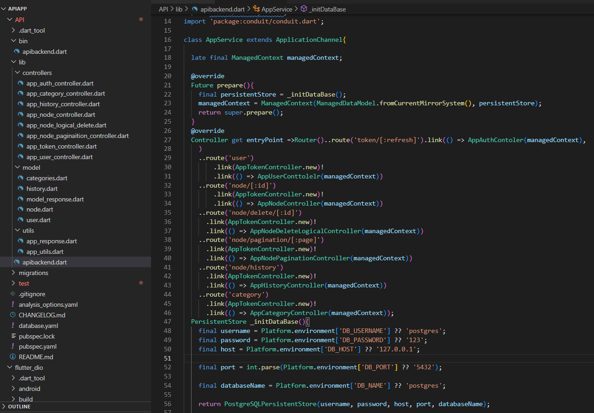
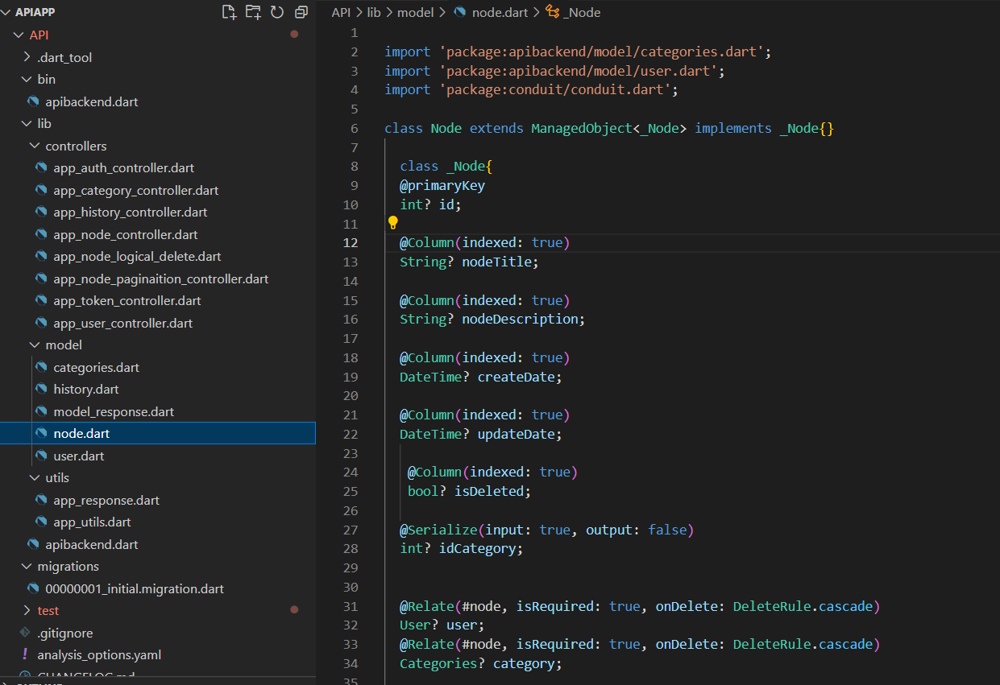
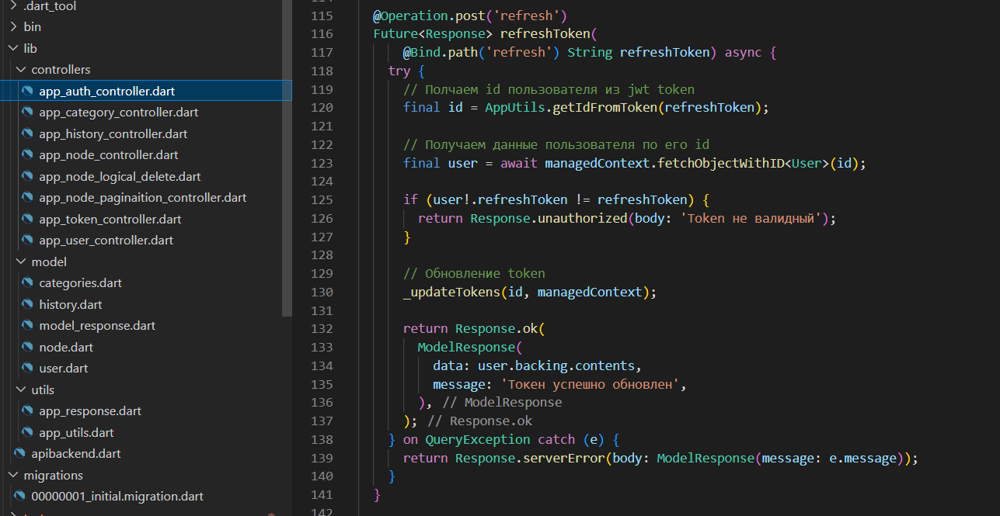
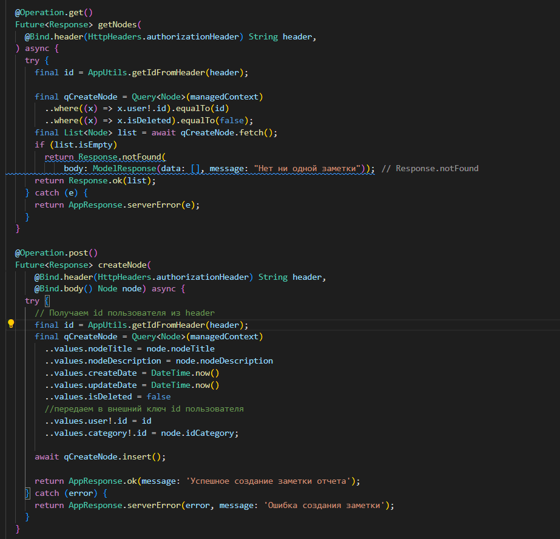
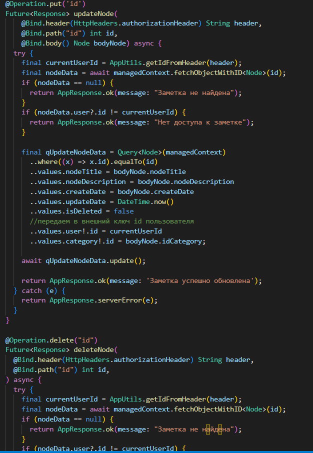
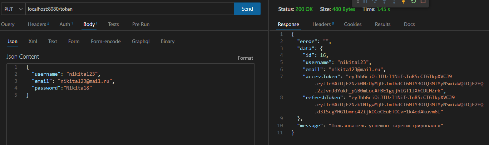
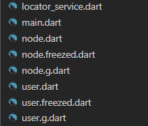
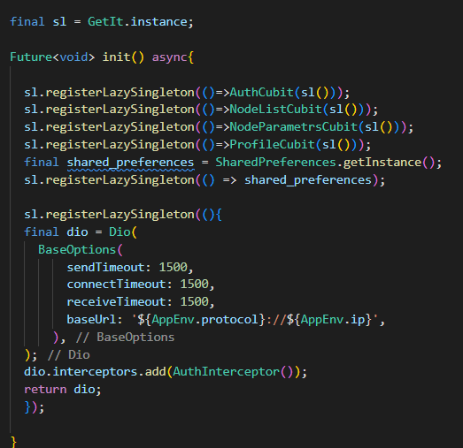
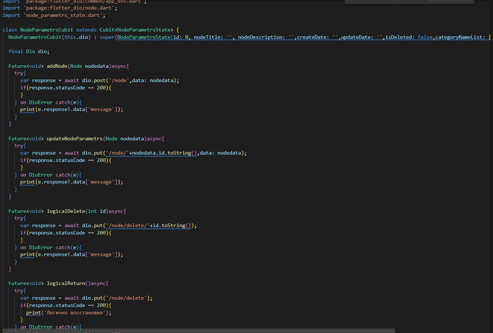
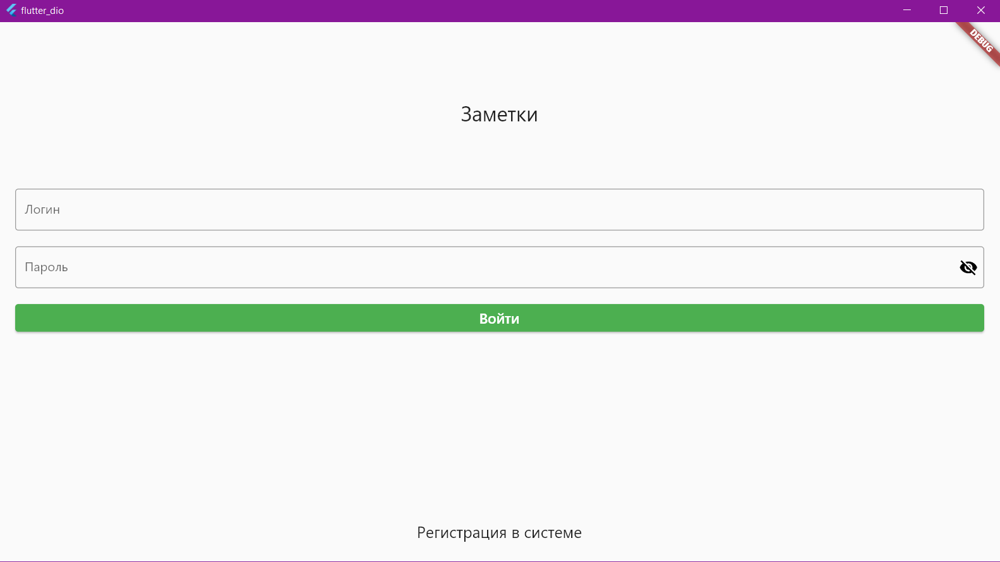

# Практические работы 1 и 2

## Создание Api с помощью conduit и приложения для него

<b>Цель работы:</b> Создать Api при помощи пакета coduit, а также приложение которое сможет принимать и обрабатывать API запросы.

Создаем Api.

Иерархия проекта и настройки приложения:

Далее создаем модели и затем в терминале прописываем команды <i>conduit</i> для создания этих таблиц в базе данных, после чего в папке миграций должна появиться новая запись.

Далее переходим к созданию контпроллера для авторизации пользователя через токен.

Затем прописываем контроллеры с методами CRUD для заметок и пользователей, которые будут почти идентичны. Методы get и post:

Методы put и delete:

После чего можно проверить работу непосредственно самой API.

После того, как работа API полностью проверена можно приступать к разработке приложения. Для его создания нам понадобятся <i>Freezed, dio, get_it, bottomNavigationBar, searchDelegat</i>

Сначала прописываем в консоли команды для freezed, который поможет производить сериализацию и десериализацию данных в формат Json.

далее прописываем interceptor, который необходим для авторизации пользователей и хранения refresh token'a.

Разрешения для экранов на синглтон, чтобы мы могли переходить на них.

Вся логика взаимодействия с api прописана в cubit, для того чтобы удобно отправлять запросы использовался dio. Пример cubit:

После чего проверяем работу приложения

<b>Вывод:</b> в ходе практической работы удалось Создать Api при помощи пакета coduit, а также приложение которое принимает и обрабатывает API запросы.

